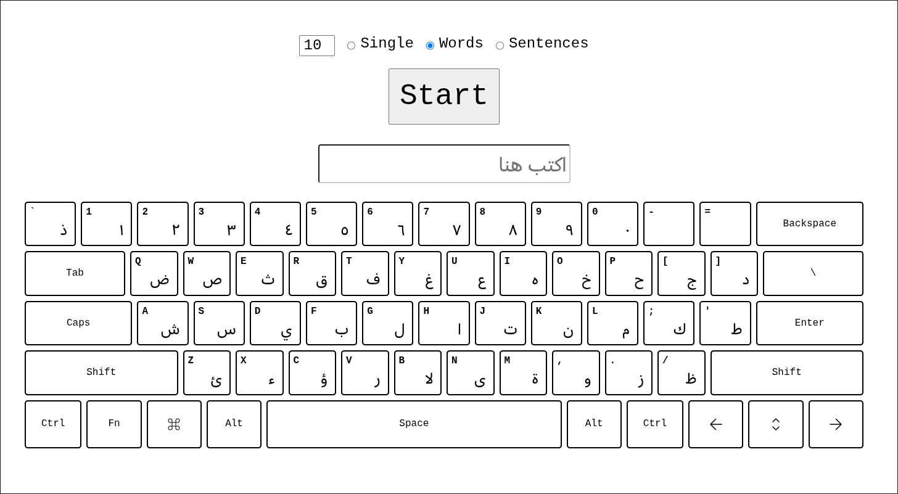

# ar-practice

ar-practice is a way to practice typing Arabic on an English keyboard. It provides a virtual keyboard that shows the English character on the keyboard and the corresponding Arabic character.

You can practice by only typing the letters, typing full words and even full sentences.

Check it out here: https://hashovic.github.io/ar-practice

